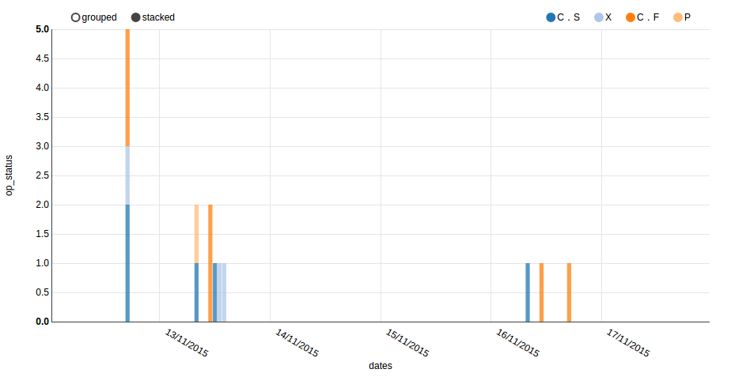

# Extended example
## Aggregated qualitative attribute

This example shows how to use NVD3 in conjunction with AngularJS. To make it easier, this example use Angular-nvd3 directive to customize the component via JSON API.

It shows the different statuses a button has had in 6 days. Button status is a qualitative value whose values can be: C.S, X, C.F and P.
The xAxis acts as Timeline and has a mark every day at 00:00 (local time). This way, each day of the period is represented although there are
 no samples for it. The yAxis represents the number of times the button has been in that status within an hour. this is, the
 graph represent the aggregation of status values per hour: Ex. "on 13/11/2015, 08:00-09:00 the button has been 1 time in P and 1 time in C.S. Total: 2 statuses in one hour.

It is built on top of Angular-nvd3 example [MultiBarChart](http://krispo.github.io/angular-nvd3/#/multiBarChart), using D3.js customizations.
The performed customizations are:
* MultibarChart needs a [d3 ordinal scale](https://github.com/mbostock/d3/wiki/Ordinal-Scales) for its xDomain but we need a [quantitative time scale](https://github.com/mbostock/d3/wiki/Quantitative-Scales) to show a timeline.
We have modified the default MultiBarchart xDomain to use an ordinal scale
that simulates a timeline with set marks. It uses a time Interval scale that manages timezones and daily saving time
 problems: [time interval range](https://github.com/mbostock/d3/wiki/Time-Intervals#interval_range)
* Customize the `xAxis.tickValues` to show the marks that we want in the xAxis. For example, one mark each day at 00:00
* Customize the format that will be shown in each xTick label in xAxis ("D/M/yy", "M/d/yy"...) depending on AngularJS locales
* Customize the tooltip header
* Implement a custom zooming+panning to make it easier to see large periods of time.

This example is developed following the MVC of AngularJS.

By default, the code of service.js loads the samples data from a local source file [samples.js](samples.js). This file
has been generated from a real aggregated data response of sth-comet. If you have a real instance of sth-comet you can use this
example to make an AJAX request via AngularJS $http service to your instance just by changing the URL endpoint, headers and `loadLocalData` variable in [service.js](service.js)
and params (entity, dates) in `init()` function of [controller.js](controller.js)

**NOTICE**:
* If you are using the AJAX request, the HTML file cannot be opened directly on your browser (protocol: file://).
 It must be served from a Web Server such as [Apache](https://httpd.apache.org/) or [Nginx](http://nginx.org/).
* Due to [Same Origin Policy](https://en.wikipedia.org/wiki/Same-origin_policy) of browsers, a file served by an origin cannot make a request to another origin (different protocol, host or port).
To avoid this, you can configure a reverse proxy in your Web Server. [HOWTO Apache](http://www.apachetutor.org/admin/reverseproxies) [HOWTO Nginx](https://www.nginx.com/resources/admin-guide/reverse-proxy/).