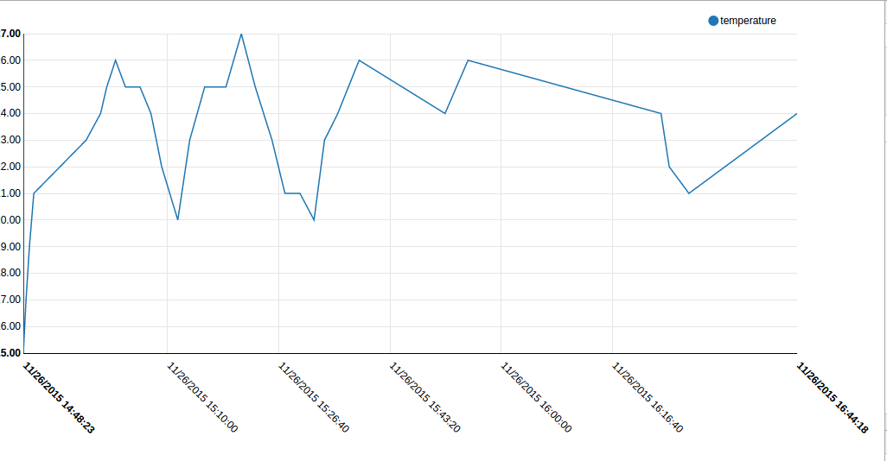

# Simple example
## Raw numerical attribute

This simple example shows how to visualize numerical raw data provided by STH with a simple chart: LineChart.
It is built on top of NVD3 [LineChart](http://nvd3.org/examples/line.html), using D3.js as a basis.

It shows the evolution in two days of data received from a temperature sensor. The xAxis acts as Timeline whereas yAxis represents the Temperature in ºC

By default, the code of lineChart.js loads the samples data from a local source file [samples.js](samples.js). This file
has been generated from a real raw data response of sth-comet. If you have a real instance of sth-comet you can use this
example to make an AJAX request to your instance just by changing the URL endpoint and params and the `loadLocalData` variable in `loadData()` method of [lineChart.js](lineChart.js)

**NOTICE**:
* If you are using the AJAX request, the HTML file cannot be opened directly on your browser (protocol: file://).
 It must be served from a Web Server such as [Apache](https://httpd.apache.org/) or [Nginx](http://nginx.org/).
* Due to [Same Origin Policy](https://en.wikipedia.org/wiki/Same-origin_policy) of browsers, a file served by an origin cannot make a request to another origin (different protocol, host or port).
To avoid this, you can configure a reverse proxy in your Web Server. [HOWTO Apache](http://www.apachetutor.org/admin/reverseproxies) [HOWTO Nginx](https://www.nginx.com/resources/admin-guide/reverse-proxy/).